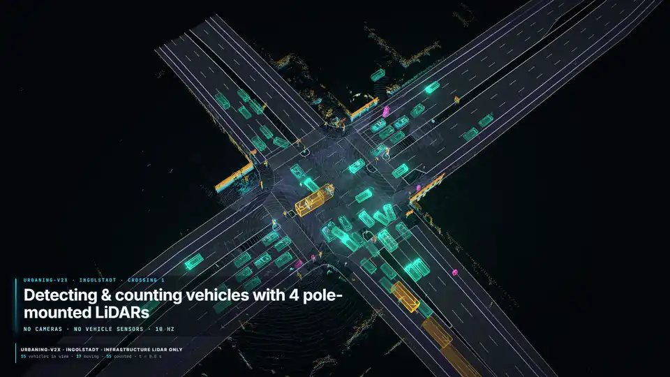
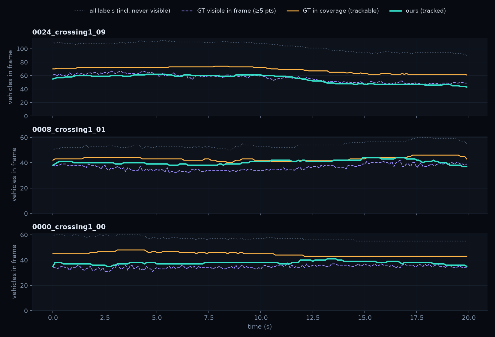
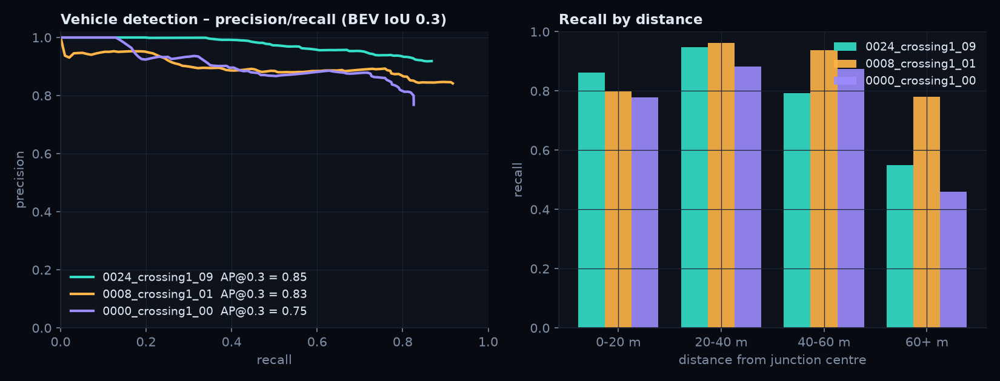
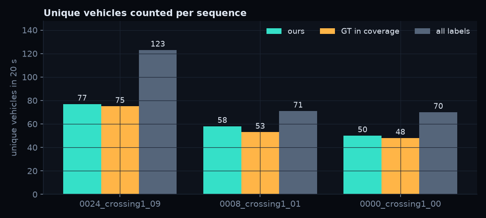
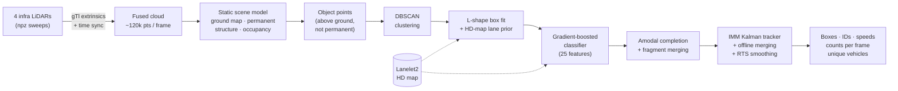
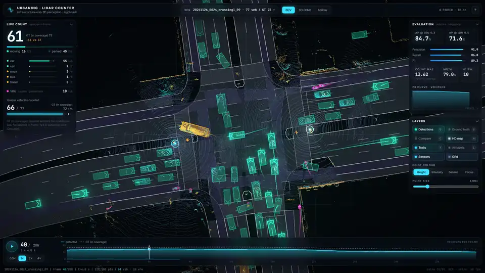

<div align="center">

# urbaning-lidar-counter

**Detecting, boxing, tracking and counting vehicles at a real urban intersection<br/>using only four fixed, pole-mounted LiDARs.**



<sub>Real data from UrbanIng-V2X crossing 1 (Ingolstadt), rendered with the interactive 3D viewer in <a href="web/">web/</a>.
Full-resolution videos: see the <a href="https://github.com/saidshamkhali/urbaning-lidar-counter/releases/latest">latest release</a>.</sub>

### ▶ [Open the live 3D demo](https://saidshamkhali.github.io/urbaning-lidar-counter/)

<sub>Desktop browser recommended · streams ~1 MB of point cloud per frame</sub>

</div>

---

## The task

[UrbanIng-V2X](https://github.com/thi-ad/UrbanIng-V2X) ([paper](https://arxiv.org/abs/2510.23478), NeurIPS 2025) is a public
cooperative-perception dataset recorded at real intersections in Ingolstadt, Germany. At each intersection several
LiDARs are mounted on the infrastructure's own poles. They are synchronised, calibrated to a common coordinate frame and
observe the traffic continuously from above.

> Using **only the infrastructure LiDARs** of a single intersection, **detect** the vehicles, produce **bounding boxes**
> and **count** them, on the sequences `20241126_0024_crossing1_09`, `20241126_0008_crossing1_01` and
> `20241127_0000_crossing1_00`.

## Results

All three sequences (600 frames, 60 s, ~120 k points per frame). Detection is evaluated against the vehicles that the
infrastructure LiDARs can actually see (see [why](#a-note-on-ground-truth) below).

| | `…0024_crossing1_09` | `…0008_crossing1_01` | `…0000_crossing1_00` | **overall** |
|---|:---:|:---:|:---:|:---:|
| Vehicle AP @ BEV IoU 0.3 | 0.85 | 0.83 | 0.75 | **0.81** |
| Vehicle AP @ BEV IoU 0.5 | 0.72 | 0.67 | 0.67 | **0.68** |
| Precision / recall (IoU 0.3) | 0.92 / 0.87 | 0.84 / 0.92 | 0.77 / 0.83 | **0.85 / 0.87** |
| **Unique vehicles counted** (ours / GT in coverage) | **77 / 75** | **58 / 53** | **50 / 48** | **185 / 176** |
| Vehicles per frame: MAE vs visible GT | 2.5 (on ~56) | 4.3 (on ~36) | 3.2 (on ~35) | **3.3** |
| MOTA / ID switches | 0.79 / 10 | 0.74 / 7 | 0.58 / 3 | **0.72 / 20** |
| Runtime (detection, CPU) | 0.41 s/frame | 0.40 s/frame | 0.35 s/frame | |

<p align="center">
  
  
</p>
<p align="center"></p>

Machine-readable results live in [`outputs/results/`](outputs/results) (`detections.json` with every box, track and
count per frame, plus `metrics.json` per sequence and `summary.json`).

## How it works



1. **Fusion.** Each sweep is moved into the global frame with its calibration, and the four synchronised sweeps are concatenated.
2. **Static scene model.** The sensors never move, so we learn the empty scene:
   * a refined ground-elevation map;
   * per-voxel occupancy statistics. Voxels occupied in *every* sequence (recorded on two different days) are façades,
     poles and trees, and they are removed. Voxels occupied throughout *one* sequence are typically parked cars.
3. **Clustering and box fitting.**
   * DBSCAN in bird's-eye view.
   * Search-based **L-shape fitting** for the heading.
   * An **HD-map lane-direction prior** for sparse clusters. Half of the vehicle clusters have fewer than 30 points, and
     for those the lane prior raised the median box IoU from 0.21 to 0.53.
   * **Amodal completion** away from the sensor, and fragment merging.
4. **Learned classification.** A gradient-boosted tree model classifies every cluster as car, van, truck, bus, cyclist,
   pedestrian or background, from geometry, point statistics, intensity, motion and map context. Training labels are
   mined automatically from the annotations, and models are trained **leave-one-sequence-out**, so every sequence is
   processed by a model that never saw it.
5. **Tracking.** A stationary/constant-velocity IMM Kalman filter handles each track:
   * Hungarian association with Mahalanobis gating;
   * heading taken from motion, and size and class voting;
   * suppression of fragments and duplicates;
   * an offline pass that merges track fragments and smooths trajectories.
6. **Counting.**
   * Per frame: confirmed vehicle tracks present, split moving / parked.
   * Per sequence: unique vehicle tracks.

The full write-up with every design decision is in **[docs/METHOD.md](docs/METHOD.md)**.

### A note on ground truth

The UrbanIng-V2X labels were created with the vehicles' sensors as well. Many labelled cars are **never seen by the
infrastructure LiDARs**, for example a parking lot behind a building. On average only ~60 % of the labelled vehicles
contain ≥ 5 infrastructure points in a given frame. Scoring against *all* labels would mostly measure sensor coverage,
so three references are used:

| reference | definition | used for |
|---|---|---|
| **visible** | ≥ 5 infrastructure points inside the box in this frame | detection metrics (the rest is KITTI-style *don't care*) |
| **in coverage** | vehicle visible in ≥ 5 frames, counted in every frame it exists | counting / unique vehicles |
| **all labels** | everything in the label file | context only |

Our per-frame count sits between the "visible" and "in coverage" references. It is closest to "visible", because
parked cars that stay hidden behind passing traffic for many seconds are dropped rather than extrapolated.

## The 3D viewer

A Three.js app ([`web/`](web)) that plays back the fused point clouds with detections, tracks and live counts:



* **Views:** bird's-eye view, 3D orbit, and a follow-cam on any selected track.
* **Scene:** glowing class-coloured boxes with heading chevrons, motion trails, and the HD-map overlay.
* **Colour modes:** height, intensity, per-sensor, and "focus" (static background dimmed).
* **Evaluation:** a *Compare* mode that marks true positives, false positives and misses against the ground truth.
* **Live panels:** counts by class, moving/parked, and unique vehicles so far, plus an evaluation panel (AP, P/R, MAE, MOTA).
* **Timeline:** a chart of detected vs ground-truth vehicles per frame, which also works as a scrubber.
* **Automation:** `window.__viewer` API and URL parameters, used by [`tools/recorder`](tools/recorder) to render frame-exact videos.

| key | action | key | action |
|---|---|---|---|
| `Space` | play / pause | `←` `→` | step frame |
| `1` `2` `3` | BEV / orbit / follow | `D` `G` `C` | detections / GT / compare |
| `M` `T` | map / trails | `F` | follow selected track |

## Run it yourself

Requirements: Python ≥ 3.11, Node ≥ 20, [7-Zip](https://www.7-zip.org) and ffmpeg (ffmpeg is only needed for videos).
About 11 GB of download.

```bash
python -m venv .venv
.venv/Scripts/pip install -r requirements.txt        # Linux/macOS: .venv/bin/pip

python scripts/download_data.py                      # 3 sequences, LiDAR + calibration only
python scripts/run_pipeline.py                       # detect → track → count → evaluate → export (~5 min)
python scripts/make_figures.py                       # README figures

cd web && npm install && npm run dev                 # open http://localhost:5173
```

Render videos (with the dev server running):

```bash
cd tools/recorder && npm install && npx playwright install chromium
node cinematic.mjs --seq 20241126_0024_crossing1_09 --out ../../outputs/video/cinematic_09
node record.mjs --url http://localhost:5173/ --seq 20241126_0024_crossing1_09 --shots "bev:0-199" --out ../../outputs/video/bev_09
```

Tests: `python -m pytest -q` (46 tests: geometry, evaluation, labels, tracking).

## Repository layout

```
ulc/                     the pipeline (Python package)
  io.py                  sequence loading, sensor fusion, Lanelet2 map projection
  background.py          static scene model: ground map, permanent structure, occupancy
  semantic_map.py        rasterised HD-map layers and the lane-direction field
  detect.py              clustering, L-shape fitting, lane prior, amodal completion, merging
  classify.py            auto-labelled training data + gradient-boosted classifier (LOSO)
  tracking.py            IMM Kalman multi-object tracker with offline refinement
  evaluate.py            BEV IoU, AP, counting, CLEAR-MOT, visibility-aware GT
  geometry.py, labels.py, schema.py
scripts/                 download_data.py · run_pipeline.py · make_figures.py
web/                     Three.js viewer (Vite + TypeScript)
tools/recorder/          Playwright-driven video capture
docs/                    METHOD.md · DATA_FORMAT.md (pipeline ↔ viewer contract) · figures
outputs/results/         our detections, tracks, counts and metrics
tests/                   pytest suite
```

## Limitations and next steps

* **Hyper-parameters.** The classifier is evaluated strictly leave-one-sequence-out, but the geometric stages and the
  tracker were tuned on these same three sequences (the task provides no others for this crossing). Treat the numbers as
  development-set results.
* **Error sources.**
  * Remaining false positives are mostly sparse static clutter 40–60 m away (6–12 points).
  * Remaining misses are mostly cars parked side by side that merge into one cluster, and very distant vehicles.
* **Next step.** A learned 3D detector, e.g. PointPillars trained on the other crossing sequences through the dataset's
  OpenCOOD integration, would be the natural next step, with this pipeline as a strong unsupervised baseline and as an
  auto-labeller.

## Data licence and citation

The dataset is © its authors and released under **CC BY-NC-ND 4.0**. This repository contains **no dataset files**:
everything is downloaded and generated by the scripts, and the committed results are our own detections and metrics.

The [live demo](https://saidshamkhali.github.io/urbaning-lidar-counter/) is built by a
[GitHub Actions workflow](.github/workflows/pages.yml) that downloads the data from Dataverse, runs the pipeline and
publishes the viewer. It shows the measurements unaltered, only converted to a web format for visualisation (sensors
fused into the dataset's global frame, 1 cm precision), with attribution and the licence stated in the viewer.
It is a non-commercial demonstration and is not endorsed by the dataset authors.

If you use the data, cite:

```bibtex
@inproceedings{urbaningv2x2025,
  title     = {UrbanIng-V2X: A Large-Scale Multi-Vehicle, Multi-Infrastructure Dataset Across Multiple
               Intersections for Cooperative Perception},
  author    = {Chandra Sekaran, Karthikeyan and Geisler, Markus and R{\"o}{\ss}le, Dominik and Mohan, Adithya and
               Cremers, Daniel and Utschick, Wolfgang and Botsch, Michael and Huber, Werner and Sch{\"o}n, Torsten},
  booktitle = {Advances in Neural Information Processing Systems (NeurIPS), Datasets and Benchmarks Track},
  year      = {2025},
  eprint    = {2510.23478},
  archivePrefix = {arXiv}
}
```

Code in this repository: [MIT](LICENSE).
